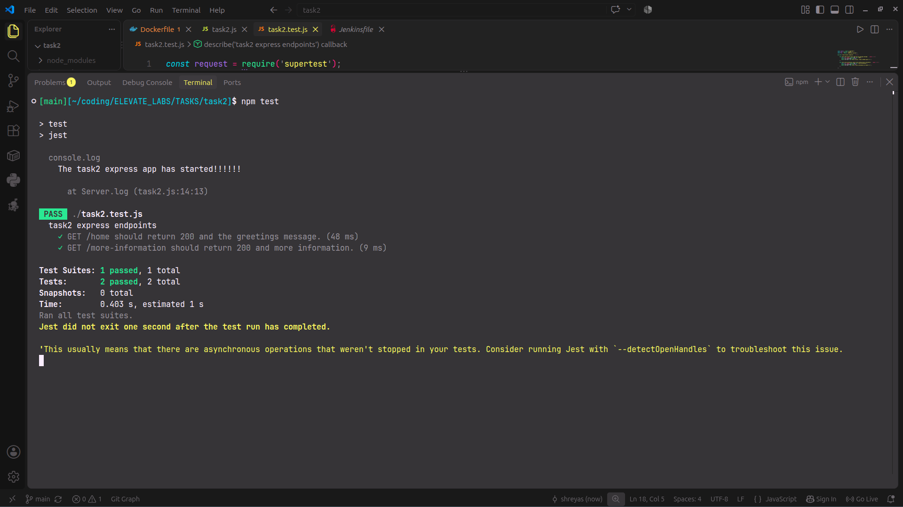
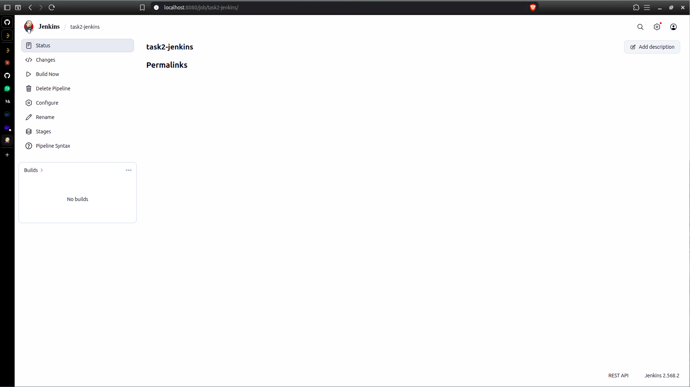

This is the task2 README.
I have written a simple express app with two endpoints as GET /home & GET /more-information.
And there is also code to test the two GET endpoints.
The CICD automation is done by Jenkins with the help of a Jenkinsfile that sits locally in my project directory.
This automation pipeline will test the app, build it, and deploy it on Dockerhub.
The pipeline will be triggered on each git push I do. And each time it will re run the stages and steps.
## There are the following stages to the Jenkinsfile:
1. Checkout.
2. "Install dependencies" will install the express and other dependencies for testing.
3. "Test" will run "npm test" which will run the express server and test it.
4. "Build Docker Image" will build the image of the app.
5. "Push to DockerHub" will push this build image to DockerHub.

## Screenshots
## 1. This is the app testing phase passing succesfully without jenkins.

## 2. This is the jenkins pipeline setup phase done successfully.
